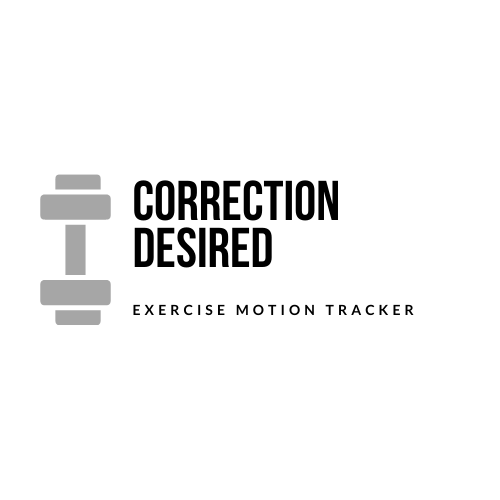
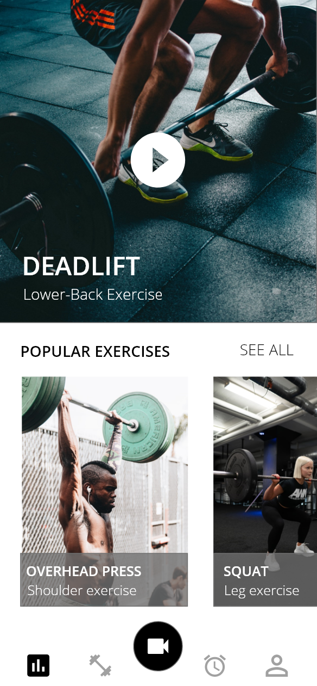
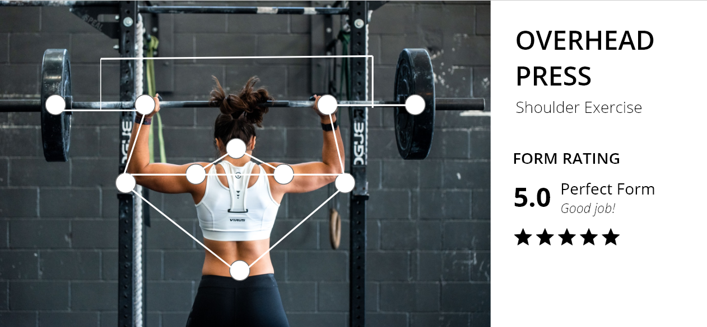
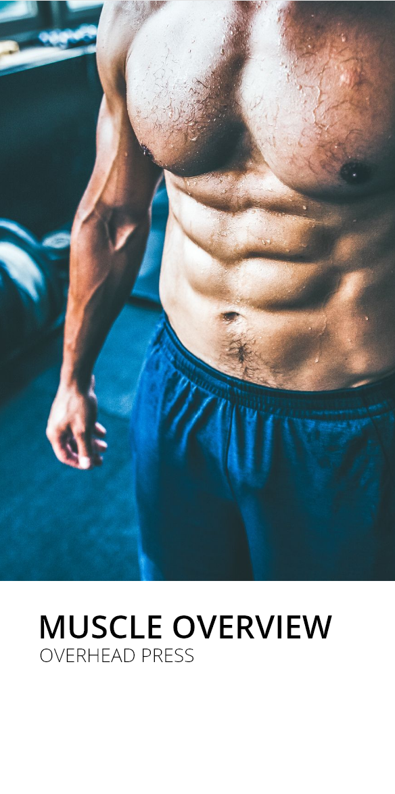
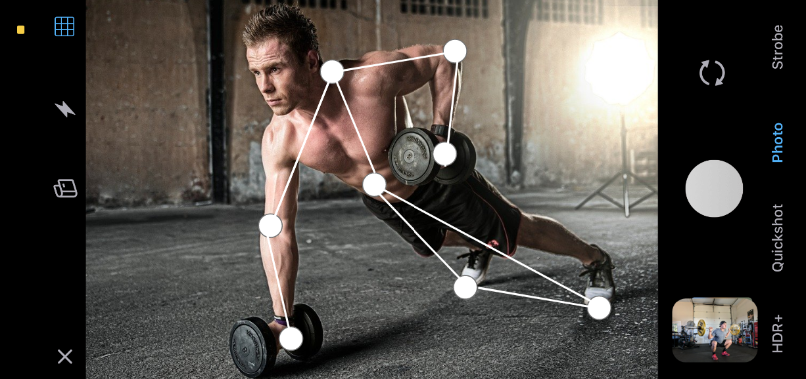

# Desired Correction

We are team of people that enjoy working out and lifting weights. Unfortunately, this sport does not come without its risks. When doing complex exercises and doing heavy loads, one technical mistake can lead to painful and long-lasting injuries. For this reason, it is absolutely essential to perform every exercise with correct form.

The traditional way to learn these exercises correctly is to pay for a personal trainer. The modern way to learn them is using state of the art motion tracking and artificial intelligence, and having it right at your fingertips in your smartphone.

Our concept uses object tracking to analyze the path of a barbell in a live video feed from your smartphone camera. The data can then be compared to data from exercises with correct form, acquired by training a machine learning model with videos of exemplary exercises.

This concept has massive potential for expandability, including but not limited to TensorFlow-powered pose estimation for a comprehensive 3D image of joint and appendage motion.

## About

CorrectionDesired Mobile App was developed using Java and OpenCV module. Its objective is to deliver performance review of essential lifts using motion tracking and machine learning. The app brings new dimension to weightlifting, accelerating your progress.

## Technologies

This project was developed with the following technologies:

<ul>
  <li>Java</li>
  <li>OpenCV</li>
  <li>Firebase</li>
</ul>

## Visuals

  

<h3>Home screen</h3>
 
Home screen with navigation to overviews of exercises, the camera mode for evaluating form and more.

              

    

<h3>Motion tracking</h3>
 
Tracks motion to evaluate technique of various exercises.

     

<h3>Muscle overview</h3>
 
Provides overviews of muscles involved in exercises.

                

<h3>Camera mode</h3>
 
Interprets technique from a live video feed to evaluate whether the exercise is being done correctly.

